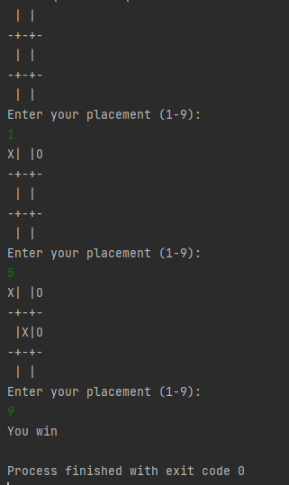

# Hello  :hand:
## This is my example of game

### *I created game board using array char and it looks cool*

>char[][] gameBoard = \
  {{' ', '|', ' ', '|', ' '},\
   {'-', '+', '-', '+', '-'},\
   {' ', '|', ' ', '|', ' '},\
   {'-', '+', '-', '+', '-'},\
   {' ', '|', ' ', '|', ' '}};
